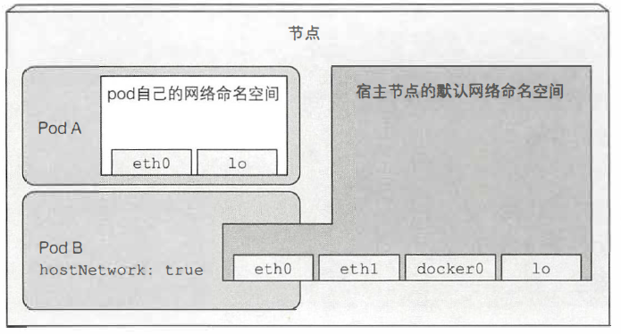
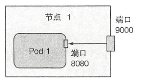
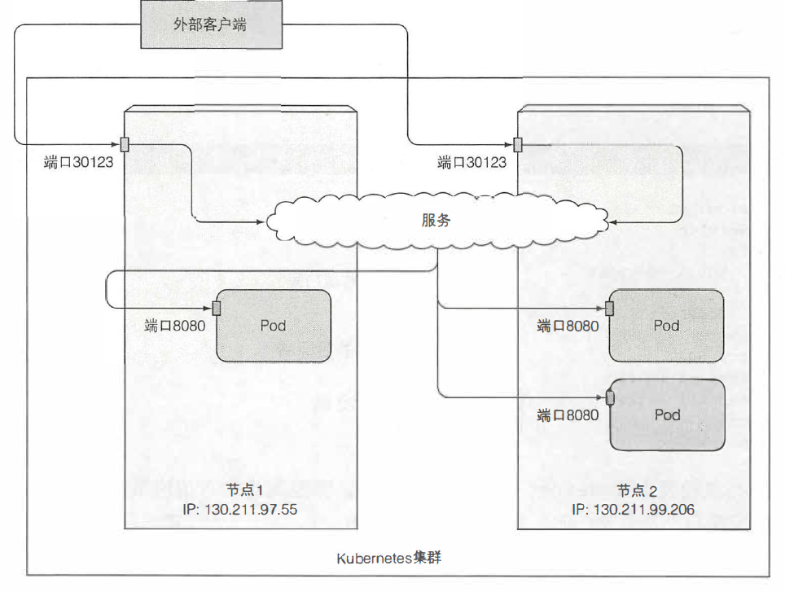
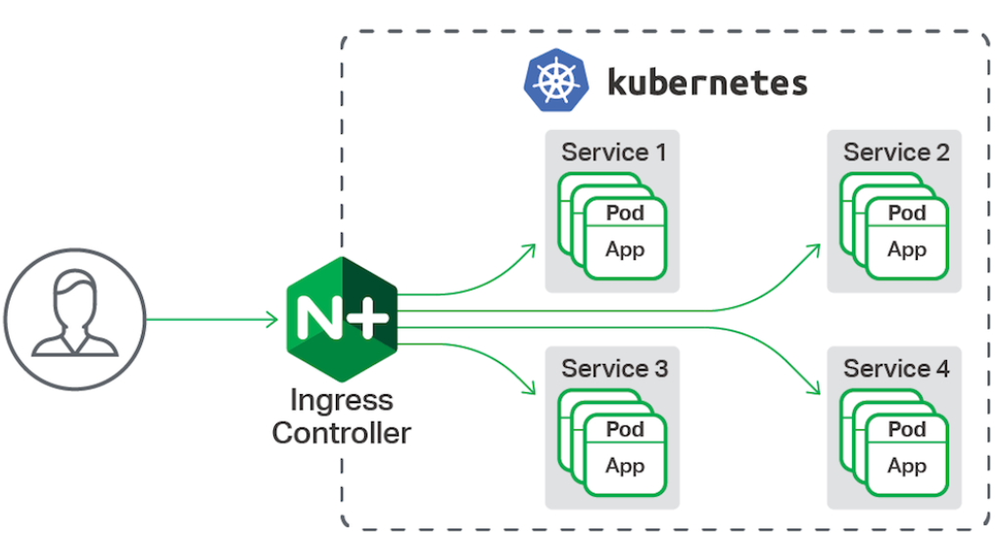

# 概述

k8s中最小的调度单位是pod，真实的一个应用服务一般是一个pod来抽象表达。
本文仔细讲述了从k8s中访问pod 的几种方式, 列表如下：

* hostNetwork
* hostPort
* NodePort
* LoadBalancer
* Ingress

# hostNework

这种模式下，就是在pod中使用宿主节点的网络命名空间。直接使用宿主节点上的网络适配器，而不是自已的虚拟网络设备。

```sh
# 通过配置参数实现
pod.spec.hostNetwork: true
```
## 示意图如下:


## 简单例子

```yaml
apiVersion: v1
kind: Pod
metadata:
  name: pod-with-host-network
spec:
  hostNetwork: true
  containers:
  - name: nginx
    image: nginx:1.8
```
### pod共享宿主机网络

```sh
# 从pod中 可以看出，网络是宿主机的网络。
# kubectl exec -it pod-with-host-network /bin/bash
root@node1:/# ip addr
1: lo: <LOOPBACK,UP,LOWER_UP> mtu 65536 qdisc noqueue state UNKNOWN group default qlen 1000
    link/loopback 00:00:00:00:00:00 brd 00:00:00:00:00:00
    inet 127.0.0.1/8 scope host lo
       valid_lft forever preferred_lft forever
    inet6 ::1/128 scope host
       valid_lft forever preferred_lft forever
2: ens33: <BROADCAST,MULTICAST,UP,LOWER_UP> mtu 1500 qdisc pfifo_fast state UP group default qlen 1000
    link/ether 00:0c:29:98:5f:cf brd ff:ff:ff:ff:ff:ff
    inet 192.168.198.128/24 brd 192.168.198.255 scope global noprefixroute ens33
       valid_lft forever preferred_lft forever
    inet6 fe80::6e14:ca0a:b952:38b0/64 scope link noprefixroute
       valid_lft forever preferred_lft forever
3: docker0: <NO-CARRIER,BROADCAST,MULTICAST,UP> mtu 1500 qdisc noqueue state DOWN group default
    link/ether 02:42:8f:13:72:dc brd ff:ff:ff:ff:ff:ff
    inet 172.17.0.1/16 brd 172.17.255.255 scope global docker0
       valid_lft forever preferred_lft forever

```

### 访问
```sh
# curl nodeIp:80
```

# hostPort
将pod的端口和宿主机器的端口进行映射，这样就可以通过宿主机器的nodeIP:port访问到pod。

# 示意图


# 例子
```sh
apiVersion: v1
kind: Pod
metadata:
  name: pod-with-hostport
spec:
  containers:
  - name: nginx
    image: nginx:1.8
    ports:
    - containerPort: 80 # 容器可以通过pod ip 80访问
      hostPort: 9000      # 通过node ip 访问 9000端口
      protocol: TCP
```
# 访问
```
# 宿主node访问
# curl nodeIp:9000
```
# NodePort
NodePort在kubenretes里是一个广泛应用的服务暴露方式。Kubernetes中的service默认情况下都是使用的ClusterIP这种类型，这样的service会产生一个ClusterIP，这个IP只能在集群内部访问，要想让外部能够直接访问service，需要将service type修改为 nodePort。
## 示意图


## 例子

```sh
# deployment
apiVersion: apps/v1     #与k8s集群版本有关，使用 kubectl api-versions 即可查看当前集群支持的版本
kind: Deployment        #该配置的类型，我们使用的是 Deployment
metadata:               #译名为元数据，即 Deployment 的一些基本属性和信息
  name: nginx-deployment        #Deployment 的名称
  labels:           #标签，可以灵活定位一个或多个资源，其中key和value均可自定义，可以定义多组，目前不需要理解
    app: nginx  #为该Deployment设置key为app，value为nginx的标签
spec:           #这是关于该Deployment的描述，可以理解为你期待该Deployment在k8s中如何使用
  replicas: 2   #使用该Deployment创建一个应用程序实例
  selector:         #标签选择器，与上面的标签共同作用，目前不需要理解
    matchLabels: #选择包含标签app:nginx的资源
      app: nginx
  template:         #这是选择或创建的Pod的模板
    metadata:   #Pod的元数据
      labels:   #Pod的标签，上面的selector即选择包含标签app:nginx的Pod
        app: nginx
    spec:           #期望Pod实现的功能（即在pod中部署）
      containers:       #生成container，与docker中的container是同一种
      - name: nginx     #container的名称
        image: nginx:1.8      #使用镜像nginx:1.7.9创建container，该container默认80端口可访问
        ports:
        - containerPort: 80
```

```sh
# NodePort 设置服务
apiVersion: v1
kind: Service
metadata:
  name: nginx-service   #Service 的名称
  labels:       #Service 自己的标签
    app: nginx  #为该 Service 设置 key 为 app，value 为 nginx 的标签
spec:       #这是关于该 Service 的定义，描述了 Service 如何选择 Pod，如何被访问
  selector:         #标签选择器
    app: nginx  #选择包含标签 app:nginx 的 Pod
  ports:
  - name: nginx-port    #端口的名字
    protocol: TCP           #协议类型 TCP/UDP
    port: 80            #集群内的其他容器组可通过 80 端口访问 Service
    nodePort: 32600   #通过任意节点的 32600 端口访问 Service
    targetPort: 80      #将请求转发到匹配 Pod 的 80 端口
  type: NodePort        #Serive的类型，ClusterIP/NodePort/LoaderBalancer
```

## 访问

```sh
# 访问任意一个节点nodeIp:port

# curl nodeIP:port
```
# LoadBalancer

TODO(需要云服务厂商提供支持)
# Ingress
以上的几种方式主要是针对四层流量转发。
Ingress会根据请求的主机名和路径决定请求转发到的服务。(主要针对http/https流量)
## 示意图



## 例子

```sh
TODO
```

## 访问

```sh
TODO
```
